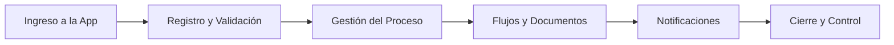
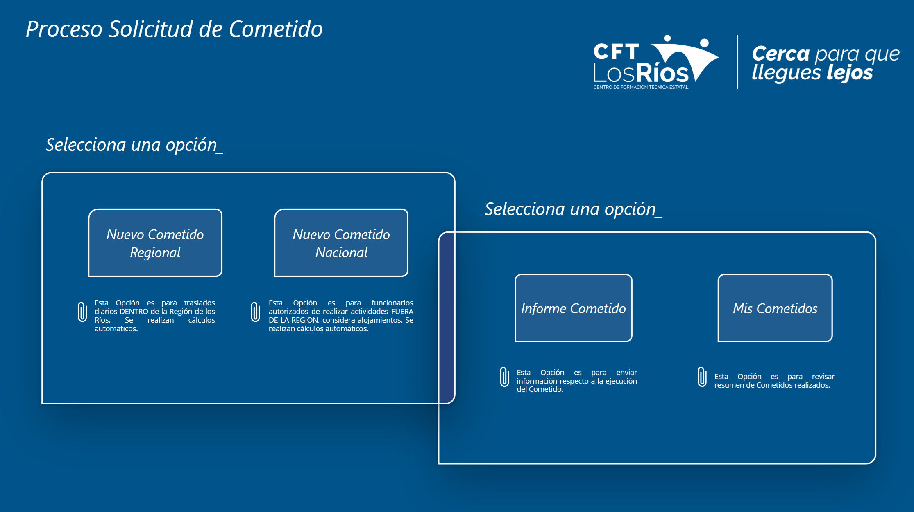

# 📱 Power Platform Business Apps

> Ecosistema de aplicaciones desarrolladas en Power Platform para digitalizar procesos internos, centralizar datos y mejorar la gestión operativa institucional.

## 📝 Objetivo
Desarrollar soluciones empresariales *low-code* utilizando Power Platform para digitalizar procesos institucionales clave. El propósito principal es mejorar la experiencia de usuario (UX), reducir la dependencia del papel y centralizar la gestión de información en aplicaciones de uso operativo diario.

## 📖 Contexto
Este repositorio presenta un portafolio de casos de desarrollo de aplicaciones construidas íntegramente con Power Platform. Estas herramientas fueron diseñadas para dar soporte a procesos institucionales complejos que involucran a múltiples actores, validaciones jerárquicas, seguimiento de estados y control documental estricto.

## 💡 Solución Desarrollada
Se diseñaron e implementaron aplicaciones funcionales orientadas a:
- Centralizar el ingreso y almacenamiento de la información.
- Facilitar la interacción y comunicación entre distintos perfiles de usuarios y áreas.
- Mejorar la trazabilidad de los procesos (saber exactamente en qué etapa está un trámite).
- Digitalizar formularios manuales y automatizar la generación de documentos.
- Apoyar y agilizar la gestión operativa y administrativa de la institución.

## 🛠️ Herramientas Utilizadas (Ecosistema MS 365)
- **Desarrollo Frontend / UI:** Power Apps (Canvas Apps).
- **Automatización Back-end:** Power Automate (Flujos de nube, Approvals).
- **Bases de Datos y Almacenamiento:** SharePoint Lists, OneDrive.
- **Captura y Generación de Datos:** Microsoft Forms, Excel, Word Templates.
- **Comunicación y Notificaciones:** Microsoft Teams, Outlook.

## 🔄 Flujo General de las Aplicaciones

## 💼 Aplicaciones Destacadas

### 🗂️ 1. Cometidos
Aplicación para gestionar integralmente el proceso de cometidos funcionarios. Contempla el ingreso de la solicitud, validación de jefaturas, aprobaciones formales, generación documental automática y seguimiento en tiempo real del estado del trámite.

### 🎓 2. Proyecto VAE
Aplicación orientada a la gestión del flujo colaborativo entre estudiantes, docentes y evaluadores. Centraliza el registro de propuestas, facilita el seguimiento académico y automatiza la validación final de los proyectos.

### 💳 3. Repactación Estudiantil
Herramienta de autoservicio para que el estudiante configure su repactación de deuda. Permite al usuario definir las condiciones del acuerdo y activa un flujo automatizado de revisión y validación directamente con el área de finanzas.

### 📊 4. Evaluación Docente
Plataforma para el cuerpo docente y coordinación académica. Permite revisar los resultados de las evaluaciones por módulo, visualizar notas, leer comentarios, calcular promedios y confirmar oficialmente el cierre del proceso.

## 👁️ Vista Previa de las Aplicaciones

  
  

  
  

> **Nota:** Las imágenes muestran las interfaces de usuario (UI). Los datos visibles son ficticios o han sido anonimizados.

## 📚 Documentación Adicional
- 🏢 [Contexto de negocio](docs/business-context.md)
- 📱 [Aplicaciones y casos de uso](docs/app-cases.md)
- 📈 [Impacto y resultados](docs/impact-and-results.md)

## ⚠️ Consideraciones
Este repositorio presenta una **versión adaptada de casos de uso reales**. Para proteger la integridad de la institución, no se expone información sensible, bases de datos reales ni detalles de las reglas de negocio internas reservadas.

## 📫 Contacto
Si quieres conocer más sobre el desarrollo de estas aplicaciones o mi trabajo en la automatización de procesos institucionales, puedes contactarme:
- 📧 **Email:** [claudio.duran.m@gmail.com](mailto:claudio.duran.m@gmail.com)
- 💼 **LinkedIn:** [Claudio Durán Molina](https://www.linkedin.com/in/claudio-duran-molina-41580677)
