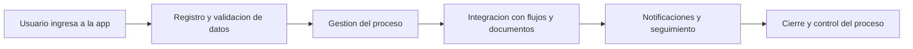

# Power Platform Business Apps

Aplicaciones en Power Platform para digitalizar procesos internos y mejorar la gestión operativa.

## Objetivo
Desarrollar soluciones en Power Platform para digitalizar procesos institucionales, mejorar la experiencia de usuario y centralizar la gestión de información en aplicaciones de uso operativo.

## Contexto
Este repositorio presenta casos de desarrollo de aplicaciones construidas con Power Platform para apoyar procesos institucionales con múltiples actores, formularios, validaciones, seguimiento y control documental.

## Aplicaciones incluidas
- Cometidos
- Proyecto VAE
- Repactación Estudiantil
- Evaluación Docente

## Solución desarrollada
Se diseñaron aplicaciones orientadas a:
- centralizar el ingreso de información
- facilitar interacción entre usuarios y áreas
- mejorar la trazabilidad de procesos
- digitalizar formularios y documentos
- apoyar la gestión operativa y administrativa

## Herramientas utilizadas
- Power Apps
- Power Automate
- Power Platform
- Outlook
- Forms
- SharePoint
- Excel
- Word Templates
- Approvals
- Teams
- OneDrive

## Flujo general

## Aplicaciones destacadas

### 1. Cometidos
Aplicación para gestionar el proceso de cometidos mediante ingreso de solicitud, validación, aprobaciones, generación documental y seguimiento del estado del trámite.

### 2. Proyecto VAE
Aplicación orientada a la gestión del flujo entre estudiantes, docentes y evaluadores, centralizando el registro, seguimiento y validación de proyectos.

### 3. Repactación Estudiantil
Aplicación para que el estudiante configure su repactación, defina condiciones del acuerdo y active el flujo de validación con el área de finanzas.

### 4. Evaluación Docente
Aplicación para revisar evaluaciones por módulo, visualizar notas, comentarios y promedios, y permitir la confirmación del proceso por parte del docente y coordinación.

## Documentación adicional
- [Contexto de negocio](docs/business-context.md)
- [Aplicaciones y casos de uso](docs/app-cases.md)
- [Impacto y resultados](docs/impact-and-results.md)

## Consideraciones
Este repositorio presenta una versión adaptada de casos reales, sin exponer información sensible ni detalles internos reservados.

## Contacto
Si quieres conocer más sobre este proyecto o mi trabajo en automatización y análisis de datos, puedes escribirme a:  
[claudio.duran.m@gmail.com](mailto:claudio.duran.m@gmail.com)
